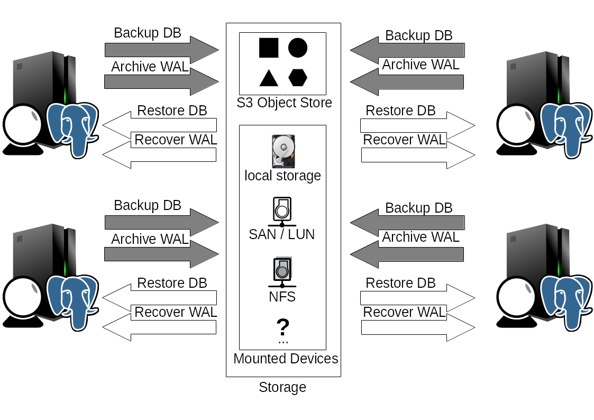
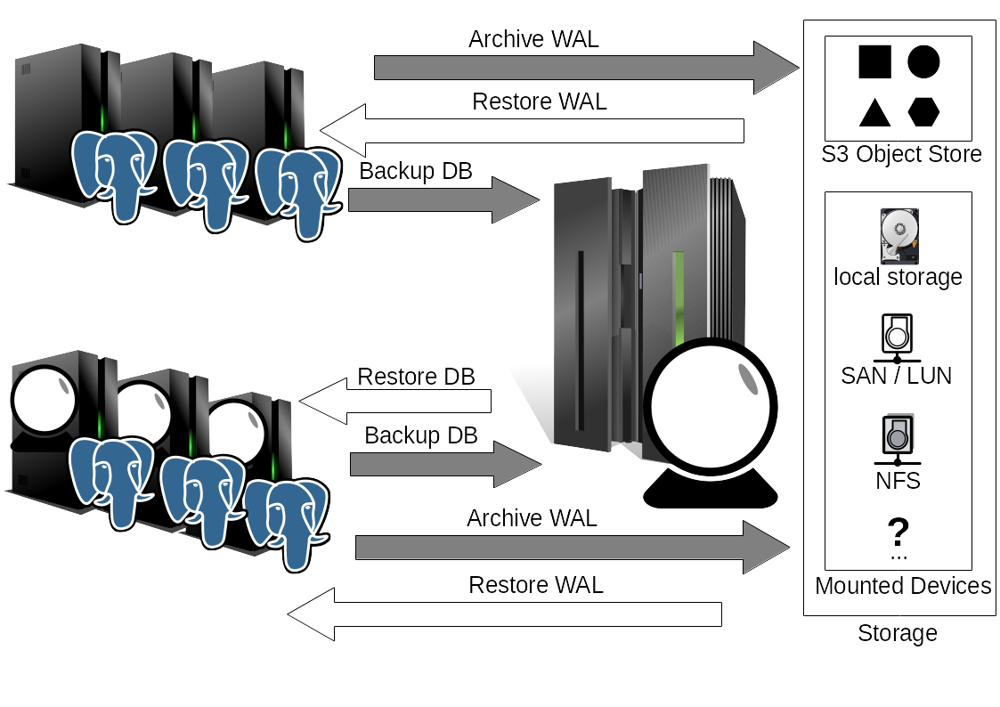

[](https://circleci.com/gh/xxorde/pgglaskugel)


# Disclaimer

This is a personal work-in-progress project!
Do not expect anything to work as intended jet!

Feel free to send bug reports, use `--debug`! :)

# pgGlaskugel

This should become an easy to use (backup) tool for PostgreSQL.

## Design
The tool should have an easy to use CLI (like git / docker) and can also be automated easy as well.

### Configuration
The configuration should be easy to use and manage.

### Setup

Comes with a simple self setup.

### Achieve
Can be used to achieve to:
* local storage / network mounts
* S3 / minio


# Example architecture

## Distributed or Single Node


This is a distributed or single node approach.
On every database server there is also an instance of pgGlaskugel.

Local storage or network mounts are accessed through the local file system.
S3 compatible object storage can be accessed by pgGlaskugel directly.

### Backup
Backups are done by calling `pgGlaskugel basebackup`. This can happen by hand, cronjob or an automation tool like Ansible.

### WAL Archiving
If WAL Archiving should be used PostgreSQL's `archive_command` is set to `pgGlaskugel archive %p` so that PostgreSQL calls pgGlaskugel for every ready WAL file.

### Retention Policy
Retention policy is enforced by calling `pgGlaskugel cleanup --retain <NUMBER OF BACKUPS TO KEEP> --force-retain`.
This is normally done via cronjob on the same machine (but there are altho other methods).

### Restore Backup
Backups are restored by a local call to `pgGlaskugel  restore --backup <BACKUP NAME> --restore-to <PATH TO NEW INSTANCE>`


## Centralized Backup Server


This example uses a central backup server that manages the backups of many database servers.

### Backups
Backups are called via cronjob or another tool according to schedule.
For every server to backup there is a different config file.
```yaml
pgGlaskugel --config server_to_backup.yml archive %p
```

Orchestration will maybe integrated later. 

### WAL Archiving
If WAL Archiving should be used PostgreSQL's `archive_command` is set to `pgGlaskugel archive %p` so that PostgreSQL calls pgGlaskugel for every ready WAL file.
Because WAL is pushed by PostgreSQL access to the WAL storage from database server is necessary.

If pgGlaskugel should not be installed the WAL segments can be compressed and transferred by other methods.


# Usage
A tool that helps you to manage your PostgreSQL backups.
     __________
    /          \
   /   ______   \
  /   /     0\   \
 /   /        \   \
 \   \        /   /
  \   \______/   /
   \  /______\  /
    \__________/

Usage:
  pgglaskugel [command]

Available Commands:
  archive     Archives given WAL file(s)
  basebackup  Creates a new basebackup from the database
  cleanup     Deletes backups and WAL files enforcing an retention policy
  ls          Shows existing backups
  recover     Recovers a given WAL file
  restore     Restore an existing backup to a given location
  setup       Setup PostgreSQL and needed directories.
  tutor       A small tutorial to demonstrate the usage
  version     Shows the version you are using

Flags:
      --archive_to string         WAL destination (file|s3) (default "file")
      --archivedir string         Dir where the backups go (default "/var/lib/postgresql/backup/pgglaskugel")
      --backup_to string          Backup destination (file|s3) (default "file")
      --config string             Config file
      --connection string         Connection string to connect to the database (default "host=/var/run/postgresql user=postgres dbname=postgres")
      --debug                     Enable debug mode, to increase verbosity
  -j, --jobs int                  The number of jobs to run parallel, default depends on cores  (default 2)
      --json                      Generate output as JSON
  -D, --pgdata string             Base directory of your PostgreSQL instance aka. pg_data (default "$PGDATA")
      --pgdata-auto               Try to find pgdata if not set correctly (via SQL) (default true)
      --s3_access_key string      access_key (default "TUMO1VCSJF7R2LC39A24")
      --s3_bucket_backup string   Bucket name for base backups (default "pgglaskugel-basebackup")
      --s3_bucket_wal string      Bucket name for WAL files (default "pgglaskugel-wal")
      --s3_endpoint string        S3 endpoint (default "127.0.0.1:9000")
      --s3_location string        S3 datacenter location (default "us-east-1")
      --s3_secret_key string      secret_key (default "yOzp7WVWOs9mFeqATXmcQQ5crv4IQtQUv1ArzdYC")
      --s3_ssl                    If SSL (TLS) should be used for S3 (default true)
      --standalone                Include WAL files in backup so it can be used stand alone

Use "pgglaskugel [command] --help" for more information about a command.
```

# Binary
Binaries are created by circleci for EVERY commit, expect them to be broken!
* Binary only [pgglaskugel](https://circleci.com/api/v1/project/xxorde/pgglaskugel/latest/artifacts/0/$CIRCLE_ARTIFACTS/pgglaskugel?circle-token=cb916b323f139fb7097f26dfca10267b1c9701a4)
* Compressed [pgGlaskugel.tar.xz](https://circleci.com/api/v1/project/xxorde/pgglaskugel/latest/artifacts/0/$CIRCLE_ARTIFACTS/pgGlaskugel.tar.xz?circle-token=cb916b323f139fb7097f26dfca10267b1c9701a4)

# Build
Have a look on https://golang.org/doc/code.html

```
mkdir $HOME/work
export GOPATH=$HOME/work
export PATH=$PATH:$GOPATH/bin

mkdir -p $GOPATH/src/github.com/xxorde/pgglaskugel/

```